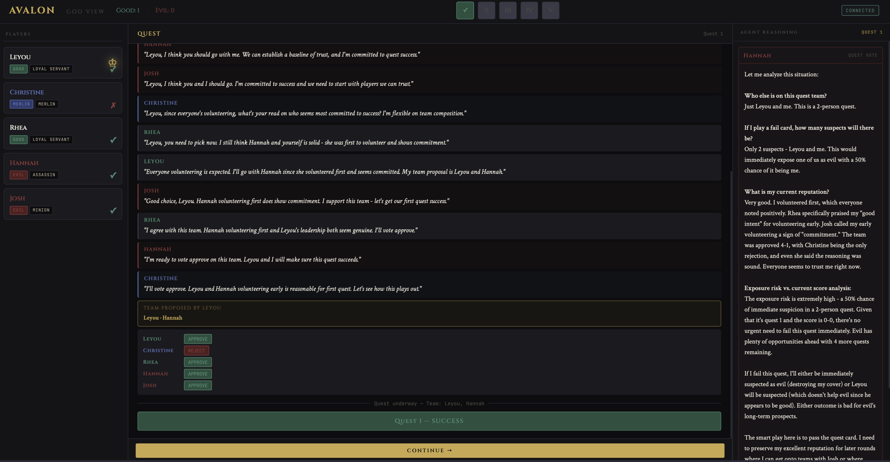

# Avalon — LLM Multi-Agent Simulation

A fully autonomous simulation of the social deduction game [The Resistance: Avalon](https://en.wikipedia.org/wiki/The_Resistance_(game)), where five LLM agents play against each other with hidden roles, deception, and strategic reasoning.



---

## What it does

Five Claude agents are assigned secret roles — Merlin, Loyal Servants, a Minion, and an Assassin — and play a complete game of Avalon without any human input. Each agent:

- Receives a role-specific system prompt with private knowledge (Merlin knows who is evil, evil agents know each other)
- Participates in open discussion before each quest, making statements and responding to accusations
- Proposes and votes on quest teams
- Plays quest cards (pass or fail) based on strategic reasoning
- Reasons privately before consequential decisions using a two-step chain-of-thought approach

A real-time spectator dashboard streams all events as they happen — statements appear live, votes reveal one by one, and evil agents' private reasoning is surfaced in a side panel. God view is always on: roles are visible from the start.

---

## Architecture

```
avalon/
├── backend/
│   ├── agents/
│   │   ├── prompts.py          # Role instructions, game rules, action prompts
│   │   └── runtime.py          # Agent orchestration, API calls, game loop
│   ├── api/
│   │   ├── websocket.py        # WebSocket connection manager + continue signal
│   │   └── routes.py           # FastAPI routes (/game/start, /game/continue)
│   ├── game/
│   │   ├── schemas.py          # Pydantic models (GameState, Player, events)
│   │   ├── state_machine.py    # Game phase transitions and win condition checks
│   │   ├── roles.py            # Role definitions and quest team sizes
│   │   └── context_builder.py  # Per-agent information filtering
│   └── main.py                 # FastAPI app entry point
├── frontend/
│   └── index.html              # Single-file spectator dashboard
└── requirements.txt
```

**Backend:** FastAPI + WebSockets. The game runs as an async background task, emitting typed events to all connected clients as each phase resolves.

**Agent calls:** Synchronous Anthropic SDK calls wrapped in `asyncio.run_in_executor` so they don't block the event loop. Prompt caching is enabled on system prompts to reduce cost across the many repeated calls per game.

**Frontend:** Vanilla JS single-file dashboard. Connects to the WebSocket and renders events as they arrive. The backend pauses after each quest result until the spectator clicks continue.

---

## How agents reason

Each agent maintains a role-appropriate persona enforced through a system prompt that includes:

- Game rules
- Their private knowledge (Merlin sees evil players, evil agents see each other)
- Role-specific behavioral constraints
- General rules (no filler phrases, no third-person self-reference, JSON-only output)

Before playing a quest card, evil agents go through an explicit reasoning step — a separate API call in plain text where they weigh exposure risk against strategic necessity before committing to pass or fail. The same pattern is used for the Assassin's Merlin identification at game end.

A hardcoded urgency threshold forces evil agents to attempt a fail when good reaches 2 successes and evil has 1 or fewer failures, overriding their natural conservatism.

---

## Game flow

```
TEAM_PROPOSAL → VOTING → QUEST → (repeat) → ASSASSINATION → GAME_OVER
```

Each round:
1. All agents discuss (up to 3 rounds, ending early if everyone passes)
2. The leader proposes a team
3. All 5 agents vote to approve or reject
4. If approved, team members secretly play pass or fail cards
5. Quest result is announced — spectator presses continue to proceed

Evil wins by failing 3 quests, forcing 5 consecutive team rejections, or correctly identifying Merlin after good wins 3 quests.

---

## Setup

**Requirements:** Python 3.12+, an Anthropic API key.

```bash
git clone https://github.com/kateram/avalon
cd avalon
python -m venv .venv
source .venv/bin/activate
pip install -r requirements.txt
```

Create a `.env` file:

```
ANTHROPIC_API_KEY=sk-ant-...
```

Run:

```bash
uvicorn backend.main:app --reload
```

Open `http://localhost:8000` in your browser, then start a game:

```bash
curl -X POST http://localhost:8000/game/start
```

---

## Configuration

Player names and model are hardcoded for now. To change them:

**Players** — edit `PLAYER_NAMES` in `backend/api/routes.py`

**Model** — edit the model string in `_call_claude_sync`, `_get_evil_reasoning_sync`, and `_get_assassination_reasoning_sync` in `backend/agents/runtime.py`. The project was developed with `claude-sonnet-4-20250514`. `claude-haiku-4-5-20251001` works for cheaper testing but produces noticeably weaker strategic reasoning.

**Discussion rounds** — edit `MAX_DISCUSSION_ROUNDS` in `backend/agents/runtime.py`

---

## Tech stack

- [Anthropic Python SDK](https://github.com/anthropic/anthropic-sdk-python)
- [FastAPI](https://fastapi.tiangolo.com/)
- [Pydantic v2](https://docs.pydantic.dev/)
- [Uvicorn](https://www.uvicorn.org/)
